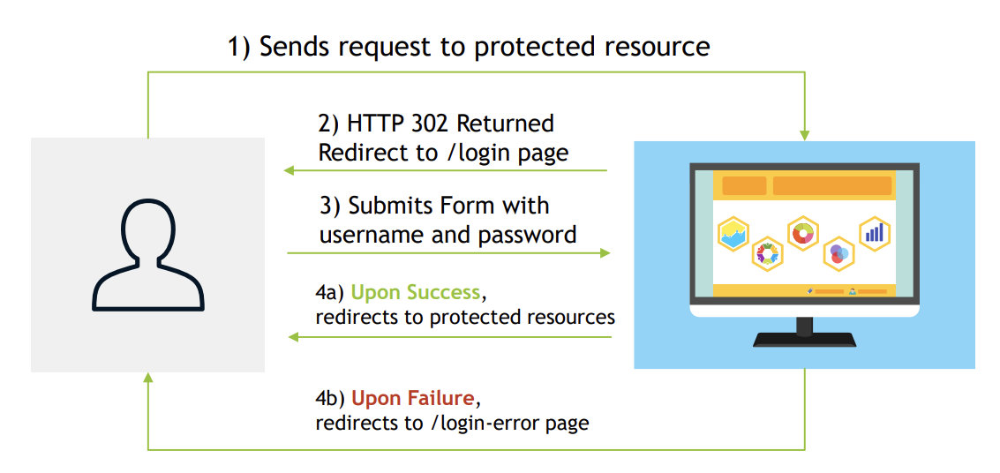
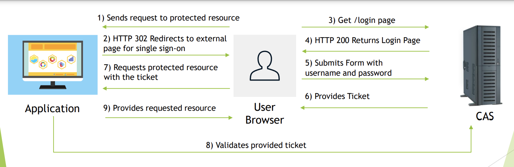
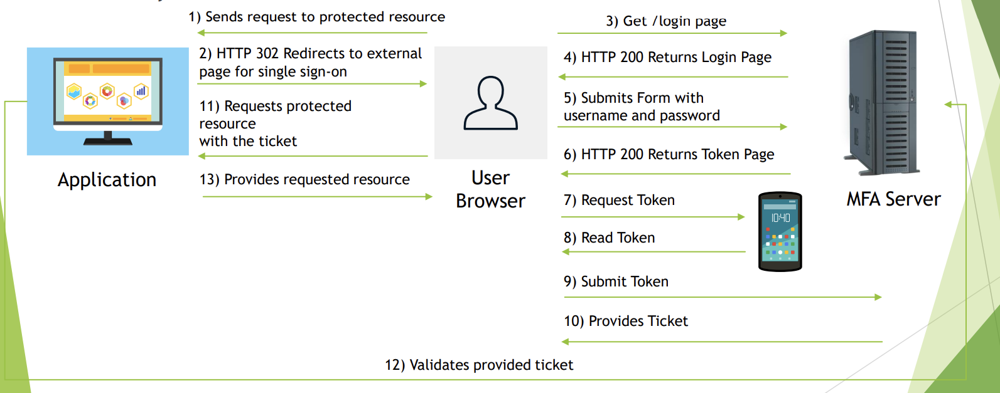
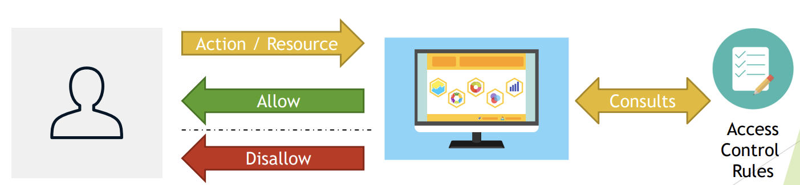
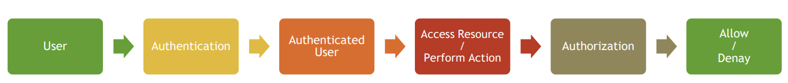

Spring Security
-----------
Authentication
--------

1. Authentication is a process of verifying that user, device or external system is who
   he/she/it claims to be. It involves validation that submitted proof of identity is true.
2. In other words, authentication answers question “Who are you?”, and checks if provided
   answer is valid.
3. Process usually involves one side sending Identity and Credential that is used to validate
   that Identity statement is true, and other side that checks Credential and accepts or
   rejects claimed Identity based on Credential.
    
4. Authentication may take different forms, simplest one uses username as Identity and
   password as credential – proof of identity.
   
5. More sophisticated forms of authentication, may involve three parties for implementation
   of Central Authentication Service (CAS) to allow single sign-on.
   
6. Recently, Multi Factory Authentication is becoming more popular to provide greater degree
   of security.
   
7. Spring Security provides following support for Authentication:
   1. Username/Password Authentication
      1. Form Login
      2. Basic Authentication
      3. Digest Authentication
   2. Remember-Me Authentication
   3. OpenID Support
   4. CAS Authentication (single sign-on)
   5. X.509 Certificate Authentication
   6. OAuth 2.0 Login
   7. SAML2
8. Storage Mechanism
   1. Simple Storage with In-Memory
      Authentication
   2. Relational Databases with JDBC
      Authentication
   3. Custom data stores with UserDetailsService
   4. LDAP storage with LDAP Authentication
9. Password Encoders:
   1. bcrypt
   2. PBKDF2
   3. scrypt
   4. sha256
   5. ....so on

Authorization
------------------
1. Authorization is a process of determining whether an authenticated user is allowed to
   access certain resources within the system or allowed to perform a certain action within
   the application.
2. In other words, authorization answers question “What are you allowed to do?”
3. Authorization usually uses formalized policy specified as access control rules, to determine
   allowed and disallowed parts of the system that authenticated user can visit and act upon.
    
4. Spring Security allows you to implement authorization within your application on
   two levels:
   1. Web Security Level with usage of Expression
      1. `mvcMatchers("/admin/**").hasRole("ADMIN")`
   2. Method Security Level with usage of:
      1. @Secured annotation
      2. @PreAuthorize annotation
      3. JSR 250 annotations
         1. @RolesAllowed
         2. @PermitAll
         3. @DenyAll
         4. ....so on
5. Access Control Rules can be expressed via:
   1. Roles
      1. Represents a high-level set of privileges, for example ROLE_ADMIN,
         ROLE_STAFF, ROLE_CUSOMERS etc.
      2. Used with expressions like hasRole
   2. Authorities
      1. Represents a low-level, granular privilege/authority in the system for example
         READ_CUSTOMERS, DELETE_EMPLOYEE, ACCESS_API etc.
      2. Used with expressions like hasAuthority
   3. Hierarchical Roles
      1. Allows you to specify relationships between roles and express that one role
         includes all permissions granted to other role
      2. Example:
         1. ROLE_ADMIN > ROLE_STAFF - ROLE_ADMIN includes ROLE_STAFF

Authentication vs Authorization
--------------------
1. Authentication needs to be executed first, before authorization,
   because for authorization process to know which roles/authorities can
   be granted for particular user, system needs to be sure that user is who
   he/she claims to be.
    

2. Example
   [Source Code](IntroAuthenAutho)
   

    

