Spring Security
-----------
Authentication
--------

1. Authentication is a process of verifying that user, device or external system is who
   he/she/it claims to be. It involves validation that submitted proof of identity is true.
2. In other words, authentication answers question “Who are you?”, and checks if provided
   answer is valid.
3. Process usually involves one side sending Identity and Credential that is used to validate
   that Identity statement is true, and other side that checks Credential and accepts or
   rejects claimed Identity based on Credential.
    
4. Authentication may take different forms, simplest one uses username as Identity and
   password as credential – proof of identity.
   
5. More sophisticated forms of authentication, may involve three parties for implementation
   of Central Authentication Service (CAS) to allow single sign-on.
   
6. Recently, Multi Factory Authentication is becoming more popular to provide greater degree
   of security.
   
7. Spring Security provides following support for Authentication:
   1. Username/Password Authentication
      1. Form Login
      2. Basic Authentication
      3. Digest Authentication
   2. Remember-Me Authentication
   3. OpenID Support
   4. CAS Authentication (single sign-on)
   5. X.509 Certificate Authentication
   6. OAuth 2.0 Login
   7. SAML2
8. Storage Mechanism
   1. Simple Storage with In-Memory
      Authentication
   2. Relational Databases with JDBC
      Authentication
   3. Custom data stores with UserDetailsService
   4. LDAP storage with LDAP Authentication
9. Password Encoders:
   1. bcrypt
   2. PBKDF2
   3. scrypt
   4. sha256
   5. ....so on

Authorization
------------------
1. Authorization is a process of determining whether an authenticated user is allowed to
   access certain resources within the system or allowed to perform a certain action within
   the application.
2. In other words, authorization answers question “What are you allowed to do?”
3. Authorization usually uses formalized policy specified as access control rules, to determine
   allowed and disallowed parts of the system that authenticated user can visit and act upon.
    
4. Spring Security allows you to implement authorization within your application on
   two levels:
   1. Web Security Level with usage of Expression
      1. `mvcMatchers("/admin/**").hasRole("ADMIN")`
   2. Method Security Level with usage of:
      1. @Secured annotation
      2. @PreAuthorize annotation
      3. JSR 250 annotations
         1. @RolesAllowed
         2. @PermitAll
         3. @DenyAll
         4. ....so on
5. Access Control Rules can be expressed via:
   1. Roles
      1. Represents a high-level set of privileges, for example ROLE_ADMIN,
         ROLE_STAFF, ROLE_CUSOMERS etc.
      2. Used with expressions like hasRole
   2. Authorities
      1. Represents a low-level, granular privilege/authority in the system for example
         READ_CUSTOMERS, DELETE_EMPLOYEE, ACCESS_API etc.
      2. Used with expressions like hasAuthority
   3. Hierarchical Roles
      1. Allows you to specify relationships between roles and express that one role
         includes all permissions granted to other role
      2. Example:
         1. ROLE_ADMIN > ROLE_STAFF - ROLE_ADMIN includes ROLE_STAFF

Authentication vs Authorization
--------------------
1. Authentication needs to be executed first, before authorization,
   because for authorization process to know which roles/authorities can
   be granted for particular user, system needs to be sure that user is who
   he/she claims to be.
    

2. Example
   [Source Code](IntroAuthenAutho)

Security a cross cutting concern
-------------
1. Yes, Security is a cross cutting concern.
2. Cross cutting concern – functionality of a program not immediately associated with the
   business logic, applicable throughout the application and affecting multiple parts of the
   system.
3. Security fits well into above definition, other examples of cross cutting concerns include
   functionalities like logging or transactions.
   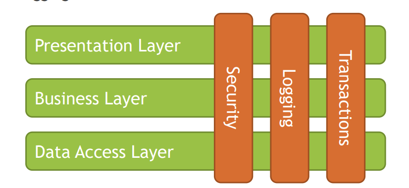
4. Security in Spring is implemented on two levels:
   1. Web Level – based on Servlet Filters
      1. Web Level Spring Security uses Servlet Filters to analyze each request made to the system,
         and based on rules specified through WebSecurityConfigurerAdapter and
         HttpSecurity object, performs certain decision against authentication or authorization.
         Such decision may include redirecting request to login page, or rejecting request because
         of roles not being assigned to the user.
         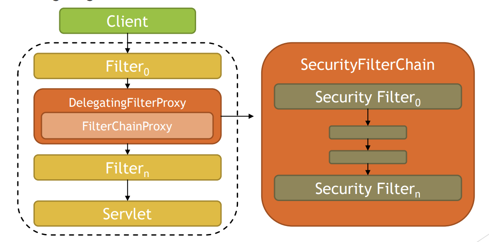
   2. Method Security Level – based on Spring AOP
      1. Method Security Level uses Spring AOP to proxy invocations to objects, applied
         advices ensures that during invocation, security rules are met to allow
         invocation, for example user needs to contain set of roles/authorities to
         execute method.
      2. To enable method level security you need to use @EnableGlobalMethodSecurity annotation and enable support to one of
         annotation types:
         1. `prePostEnabled` - Security's pre post annotations - @PreAuthorize
         2. securedEnabled - @Secured annotation - Spring Security's @Secured
            annotations
         3. jsr250Enabled – JSR 250 annotations @RolesAllowed, @PermitAll,
            @DenyAll, ...
         
5. Each aspect of Security – Authentication and Authorization is handled on both of
   those levels with different set of components:
   1. Authenthicaiton
      1. AuthenticationManager
      2. ProviderManager
      3. AuthenticationProvider
      4. UserDetailsService
   2. Authorization
      1. AccessDecisionManager
         1. AccessDecisionVoter
      2. AfterInvocationManager
      3. Authorities
6. Spring Security uses many objects to implement security:
   1. Authentication
      1. `SecurityContextHolder` – heart of Spring Security authentication model,
         place were Spring stores the details of who is authenticated
      2. `SecurityContext` – held by SecurityContextHolder, gives access to
         Authentication object
      3. `Authentication` object – used as input to `AuthenticationManager` to
         provide the credentials that user has provided to authenticate, also
         represents the currently authenticated user, contains principal, credentials,
         authorities
      4. `GrantedAuthority` - high level permissions the user is granted, for example
         roles, ROLE_ADMIN, ROLE_EDITOR, ROLE_VIEWER etc.
      5. `AuthenticationManager` - API that defines how Spring Security’s Filters
         perform authentication, usually implemented by ProviderManager
      6. `ProviderManager` – is an AuthenticationManager that delegates to list
         of AuthenticationProviders, if at least AuthenticationProvider will
         successfully authenticate user, user is logged into the system
         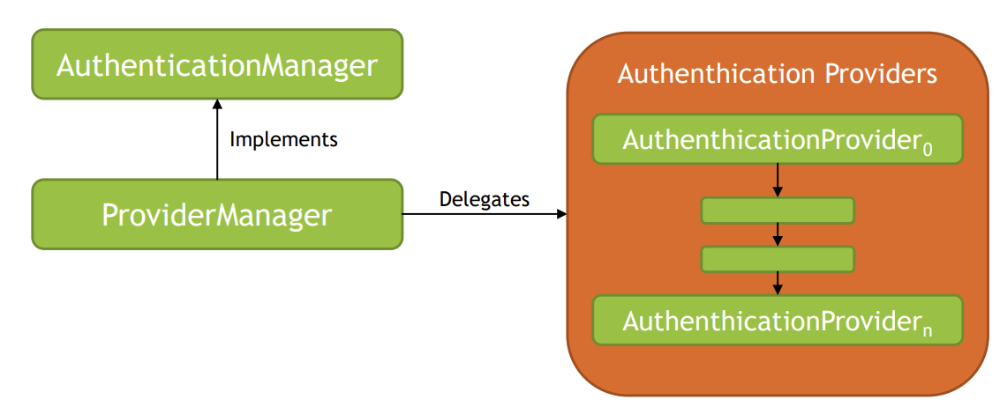
   
   2. Authorization
      1. `AccessDecisionManager` – called by SecurityInterceptors before
         executing method/action, used for authorization to check if user is allowed to
         perform certain action or access certain resource in the system based on
         GrantedAuthority objects
         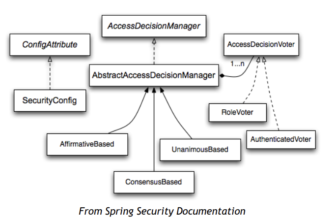
      2. `AfterInvocationManager` – called after executing method/action, used
         for authorization to ensure the principal is permitted to access the domain
         object instance returned by a service layer bean
         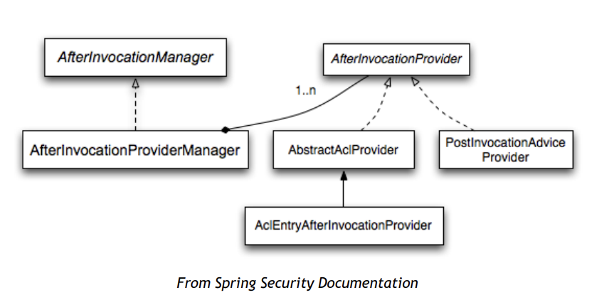

7. Spring Security is able to access list of users and authorities based on
   UserDetailsService abstraction, following storage types are supported:
   1. Simple Storage with In Memory Authentication
   2. Relational Databases with JDBC Authentication
   3. Custom data stores with UserDetailsService
   4. LDAP storage with LDAP Authentication
   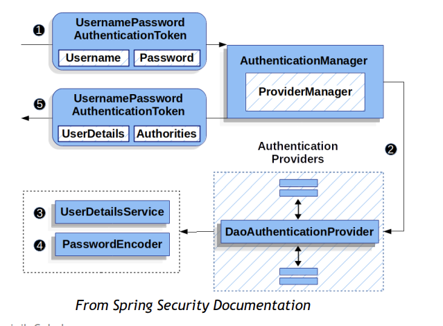
   
8. Here is an example scenario that Spring Security can handle with usage of
   Authenthiation and Authorization components:
   1. User tries to access protected resource.
   2. Application requires the user to provide username and password (form login).
      Username is identifier, password is credential.
   3. Credentials are verified by the AuthenticationManager, implemented by
      ProviderManager, which delegates to AuthenthicationProviders, user is
      granted access to the application, SecurityContext will hold authorization rights for
      this user
   4. User tries to edit some resource, which is implemented by method on controller level,
      SecurityInterceptor intercepts the request.
   5. SecurityInterceptor extracts the user authorization data from the
       SecurityContext.
   6. AccessDecisionManager is invoked to check if user is allowed to perform requested
      operation.
   7. AccessDecisionManager delegates call to a list of AccessDecisionVoters to
      check if user is allowed to perform requested operation.
   8. Access is granted or denied.

Delegating filter proxy
--------
1. DelegatingFilterProxy is an internal Spring Framework class located in
   package org.springframework.web.filter of spring-web module.
2. This class acts as a Proxy between standard Servlet Filter and Spring-managed
   Bean that implements Servlet Filter. DelegatingFilterProxy is registered
   within application container and delegates all calls to Bean registered within
   Spring Application Context.
3. We may say that it acts like a bridge between Servlet Container and Spring
   Application Context.
4. Bean to which all calls should be delegated to is located based on Filter Name
   provided within Filter Configuration, usually it is named
   springSecurityFilterChain and is an instance of FilterChainProxy.
5. DelegatingFilterProxy can be registered in following ways:
   1. Servlet 3 – via AbstractSecurityWebApplicationInitializer
      1. Method insertSpringSecurityFilterChain will register
         DelegatingFilterProxy
   2. Servlet 2 – via web.xml
      1. springSecurityFilterChain is a default name for FilterChainProxy specified in
         AbstractSecurityWebApplicationInitializer#DEFAULT_FILTER_NAME
      ```xml
      <filter>
       <filter-name>springSecurityFilterChain</filter-name>
       <filter-class>org.springframework.web.filter.DelegatingFilterProxy</filter-class>
      </filter>
       <filter-mapping>
       <filter-name>springSecurityFilterChain</filter-name>
       <url-pattern>/*</url-pattern>
      </filter-mapping>
       ```
   3. Spring Boot
      1. uses DelegatingFilterProxyRegistrationBean instead of regular
         DelegatingFilterProxy to create specialized version of DelegatingFilterProxy
      2. Registered by SecurityFilterAutoConfiguration
6. Role of DelegatingFilterProxy is to delegate all calls to
   FilterChainProxy, which contains SecurityFilterChain responsible for
   Web Level authentication and authorization:
   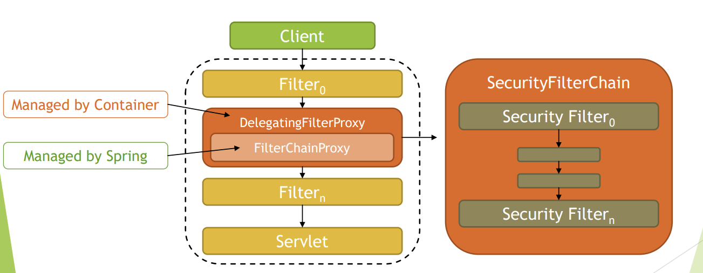


Security filter chain
-------------
1. Security Filter Chain is a collection of Spring Managed Filters that are responsible
   for authentication and authorization. Usually they include functionalities like
   Username & Password Authentication, Logout Management, Session Management,
   Security Interceptors etc.
   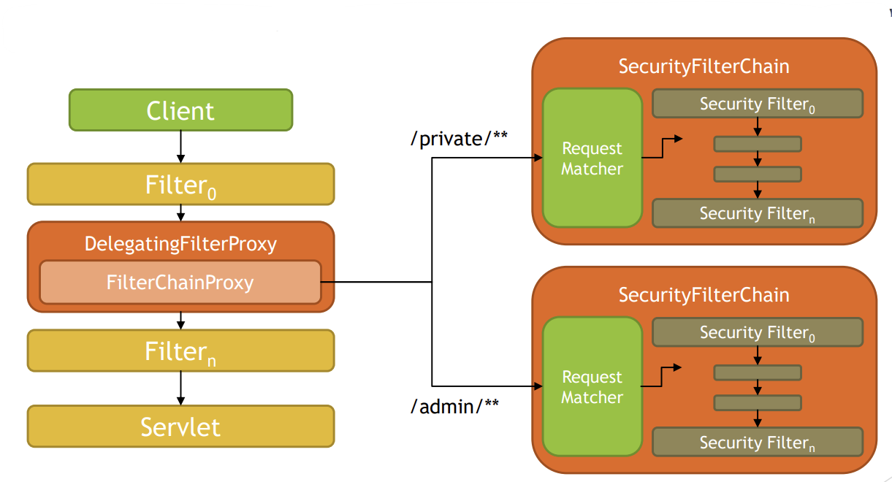
2. SecurityFilterChain is an interface located in package
   org.springframework.security.web of spring-web module.
   1. This interface specifies a contract for behavior that associates request URL to list
      of security filters.
   2. Spring provides one implementation of this interface called
      `DefaultSecurityFilterChain` which uses request matchers to check if list of
      security filters should be applied to specified url.
   3. Some of the request matchers that can be used include
      AntPathRequestMatcher, MvcRequestMatcher,
      RequestHeaderRequestMatcher, MediaTypeRequestMatcher etc.
   4. Security Filters are implementation of Servlet Filter and are usually managed by
      Spring Context.
   5. `FilterChainProxy` holds list of `SecurityFilterChains` and upon request
      searches for the first `SecurityFilterChain` that matches request.
   6. Upon request being matched, SecurityFilterChain is picked up and list of
      Filters is being fetched from SecurityFilterChain.
   7. After that FilterChainProxy executes Filters from
      SecurityFilterChain.
   8. FilterChainProxy is a registered bean in Spring Context and takes default
      name specified inside
      AbstractSecurityWebApplicationInitializer#DEFAULT_FILTER_NAME
      which is springSecurityFilterChain.
   9. FilterChainProxy is fetched from the context based on name within
      DelegatingFilterProxy.
3. Spring usually includes following Filters within Security Filter Chains:
   1. WebAsyncManagerIntegrationFilter
   2. SecurityContextPersistenceFilter
   3. HeaderWriterFilter
   4. CsrfFilter
   5. LogoutFilter
   6. UsernamePasswordAuthenticationFilter
   7. RequestCacheAwareFilter
   8. SecurityContextHolderAwareRequestFilter
   9. AnonymousAuthenticationFilter
   10. SessionManagementFilter
   11. ExceptionTranslationFilter
   12. FilterSecurityInterceptor
4. Spring provides API to customize list of used Security Filters, by extending
   WebSecurityConfigurerAdapter and overriding configure method.
   ```
   @Override
    protected void configure(HttpSecurity http) throws Exception {
        http
                .addFilterBefore(new CustomRequestParameterAuthenticationFilter(), LogoutFilter.class)
                .authorizeRequests()
                .expressionHandler(expressionHandler())
                .mvcMatchers("/", "/home").permitAll()
                .mvcMatchers("/employees").hasRole(EMPLOYEES_PAG_VIEW)
                .mvcMatchers("/departments").hasRole(DEPARTMENTS_PAG_VIEW)
                .mvcMatchers("/customers").hasRole(CUSTOMERS_PAG_VIEW)
                .anyRequest().authenticated()
                .and()
                .formLogin()
                .loginPage("/login")
                .failureUrl("/login-error")
                .permitAll()
                .and()
                .logout()
                .logoutUrl("/logout")
                .logoutSuccessUrl("/login")
                .permitAll();
       }
    ```
5. [Source Code](IntroAuthenAutho/src/main/java/com/raghu/security/intro/security/filter)

Security context
---
1. SecurityContext is an interface, allowing you to access security
   information associated with the current thread of execution. Interface
   provides two methods:
   1. getAuthentication - provides currently authenticated principal, or
       an authentication request token
   2. setAuthentication - sets currently authenticated principal, or
      removes the authentication
2. SecurityContext can be accessed via SecurityContextHolder,
   which allows access in three modes:
   1. MODE_THREADLOCAL
      1. SecurityContextHolder is set to MODE_THREADLOCAL by default,
         it allows each Thread to access it’s own dedicated SecurityContext.
         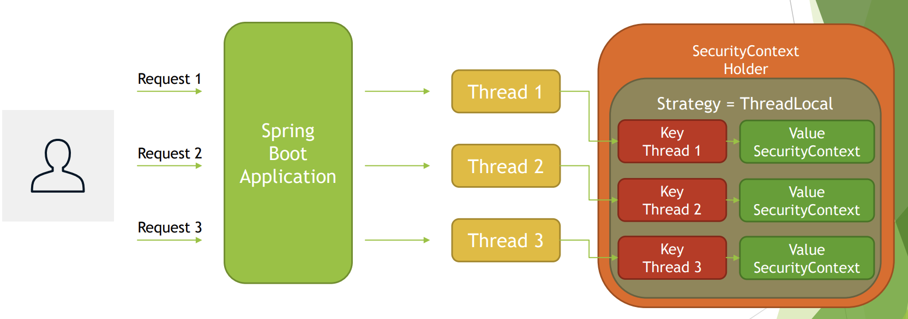
   2. MODE_INHERITABLETHREADLOCAL
      1. When SecurityContextHolder is set to MODE_INHERITABLETHREADLOCAL,
         then child threads are allowed to access same SecurityContext as parent
         Thread.
         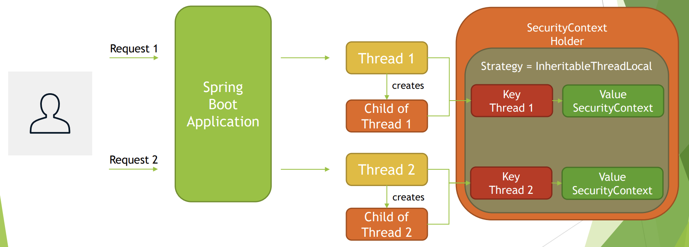
   3. MODE_GLOBAL
      1. When SecurityContextHolder is set to MODE_GLOBAL, then all threads
         within JVM are accessing same SecurityContext, this mode is usually used by
         standalone desktop applications, such as Java Swing based clients.
         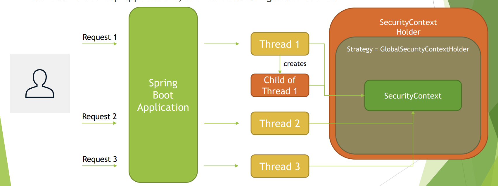
3. Mode of SecurityContextHolder can be changed via:
   1. Property - spring.security.strategy
      ```properties
       spring.security.strategy=MODE_THREADLOCAL
       spring.security.strategy=MODE_INHERITABLETHREADLOCAL
       spring.security.strategy=MODE_GLOBAL
      ```
   2. Programmatically - SecurityContextHolder#setStrategyName
      ```java
      @Configuration
        public class SecurityStrategyConfiguration {
            @Value("${spring.security.strategy}")
            private String springSecurityStrategy;
        
            @PostConstruct
            public void init() {
                SecurityContextHolder.setStrategyName(springSecurityStrategy);
            }
        }

      ```
4. SecurityContext allows you to access or set currently used
   Authentication object.
   1. Authentication object represents the token for an authentication
      request or an authenticated principal, once the authentication request
      has been processed. Authentication object contains following
      methods:
      1. `getPrincipal` - identity of the principal being authenticated
      2. `getAuthorities` – collection of authorities granted to the principal
      3. `getCredentials` - credentials that prove the principal is correct
      4. `getDetails` - additional details about the authentication request,
         address, certificate, serial number etc.
      5. `isAuthenticated`, `setAuthenticated` – for internal use by
         AbstractSecurityInterceptor, AuthenticationManager to
         control required amount of for re-authentications\
      6. Example
         ```java
         private void storeSecurityContextDataInModel(String prefix, Model model) {
                SecurityContext securityContext = SecurityContextHolder.getContext();
                Authentication authentication = securityContext.getAuthentication();
                User user = (User) Optional.ofNullable(authentication)
                        .map(Authentication::getPrincipal)
                        .orElse(null);
        
                model.addAttribute(prefix + "HashCode", Integer.toHexString(securityContext.hashCode()));
        
                model.addAttribute(
                        prefix + "Name",
                        Optional.ofNullable(authentication)
                                .map(Authentication::getName)
                                .orElse("N/A")
                );
        
                model.addAttribute(
                        prefix + "Username",
                        Optional.ofNullable(user)
                                .map(User::getUsername)
                                .orElse("N/A")
                );
        
                model.addAttribute(
                        prefix + "Authorities",
                        Optional.ofNullable(authentication)
                                .map(Authentication::getAuthorities)
                                .orElse(null)
                );
            }

         ```

** pattern in an antMatcher or mvcMatcher
--------------------------
1. ** pattern in antMatcher and mvcMatcher matches zero or more path segments
   until the end of the path.
2. antMatcher and mvcMatcher support following rules:
   1. ? - matches one character
   2. * - matches zero or more characters within a path segment
   3. ** - matches zero or more path segments until the end of the path
   4. Regexps are supported for Path Variables
      1. {spring:[a-z]+} matches the regexp [a-z]+ as a path variable named "spring"
3. For example, having following URI /departments/delete/5:
   1. /departments/delete/* - matches
   2. /departments/delete/** - matches
   3. /*/5 – does not match
   4. /**/5 – matches
   5. /departments/dele??/* - matches
4. Examples
   ```java
   @Override
    protected void configure(HttpSecurity http) throws Exception {
        http
                .authorizeRequests()
                .expressionHandler(expressionHandler())
                .mvcMatchers("/", "/home").permitAll()

                .mvcMatchers("/employees").hasRole(EMPLOYEES_PAG_VIEW)
                .mvcMatchers("/employees/view/**").hasRole(EMPLOYEE_VIEW)
                .mvcMatchers("/employees/create").hasRole(EMPLOYEE_CREATE)
                .mvcMatchers("/employees/delete/*").hasRole(EMPLOYEE_DELETE)

                .mvcMatchers("/departments").hasRole(DEPARTMENTS_PAG_VIEW)
                .mvcMatchers("/departments/view/*").hasRole(DEPARTMENT_VIEW)
                .mvcMatchers("/departments/create").hasRole(DEPARTMENT_CREATE)
                .mvcMatchers("/departments/**/delete/**").hasRole(DEPARTMENT_DELETE)

                .mvcMatchers("/c??to?er?").hasRole(CUSTOMERS_PAG_VIEW)
                .mvcMatchers("/customers/view/*").hasRole(CUSTOMER_VIEW)
                .mvcMatchers("/customers/create").hasRole(CUSTOMER_CREATE)
                .mvcMatchers("/customers/delete/*").hasRole(CUSTOMER_DELETE)

                .mvcMatchers("/**/view/**").hasRole(ALL_VIEWS)
                .mvcMatchers("/**/create/**").hasRole(ALL_CREATES)
                .mvcMatchers("/**/delete/**").hasRole(ALL_DELETES)

                .anyRequest().authenticated()
                .and()
                .formLogin()
                .loginPage("/login")
                .failureUrl("/login-error")
                .permitAll()
                .and()
                .logout()
                .logoutUrl("/logout")
                .logoutSuccessUrl("/login")
                .permitAll();
      }
   ```
mvcMatcher vs antMatcher
-----
1. mvcMatcher is more flexible and forgiving when writing down rules for Spring
   Security Configuration, thus making mistakes when securing application is harder.
2. As an example let’s consider following matcher rules:
   1. .mvcMatchers("/employees")
   2. .antMatchers("/employees")
3. Although they look very similar, they will work differently when executed against URI
   /employees and /employees/
   1. /employees
      1. `.mvcMatchers("/employees")` – matches
      2.` .antMatchers("/employees")` - matches
   2. /employees/
      1. `.mvcMatchers("/employees")` – matches
      2. `.antMatchers("/employees")` – does not match
4. So in above example, when using antMatchers it is very easy to omit last slash,
   giving attackers possibility to bypass application security rules.

Password hashing & salting
----------------------
1. Yes, Spring Security supports password hashing through PasswordEncoder
   interface and has built-in support for following encoders:
   1. bcrypt
   2. pbkdf2
   3. scrypt
   4. argon2
   5. sha256
   6. ......
2. PasswordEncoder interface contains following methods:
   1. encode - encode the raw password
   2. matches – verifies if raw password provided as input matches encoded
      password, password is never decoded, one-way algorithms are used
   3. Password hashing upon registration
      1. Upon registration password is encoded (hashed) and never stored in cleartext.
         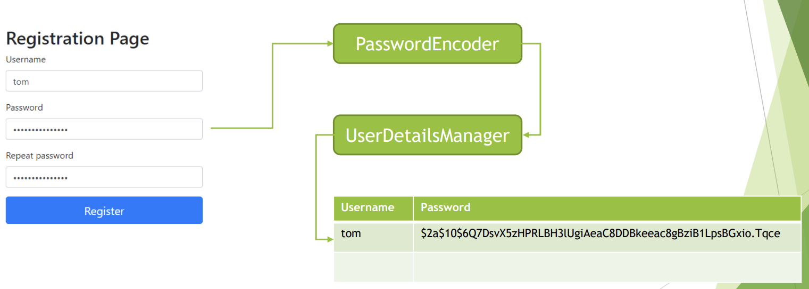
      2. Password verification upon login
         1. Upon login, provided password is encoded again and compared with one stored in
            database.
            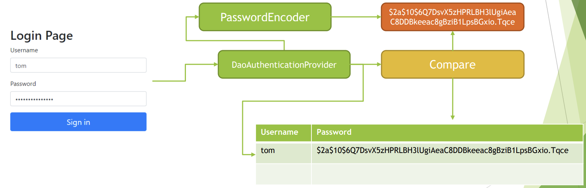
3. Spring Security also provides DelegatingPasswordEncoder, which uses one of the
   selected PasswordEncoder to encode password, and list of provided passwords
   decoders to verify password upon login.
4. DelegatingPasswordEncoder is useful as it provides flexibility and ability to
   easily switch between PasswordEncoders while keeping backward compatibility,
   for already stored hash values of passwords.
5. DelegatingPasswordEncoder stores hash values for password as calculated by
   selected PasswordEncoder with identifier stored as prefix, for example:
   {bcrypt}$2a$10$dXJ3SW6G7P50lGmMkkmwe.20cQQubK3.HZWzG3YB1tlRy.fqvM/BG
6. If storage contains other algorithms used as well, for example:
   1. {bcrypt}$2a$10$dXJ3SW6G7P50lGmMkkmwe.20cQQubK3.HZWzG3YB1tlRy.fqvM/BG
   2. {pbkdf2}5d923b44a6d129f3ddf3e3c8d29412723dcbde72445e8ef6bf3b508fbf17fa4ed4d6b99ca763d8dc
   3. {sha256}97cde38028ad898ebc02e690819fa220e88c62e0699403e94fff291cfffaf8410849f27605abcbc0
7. prefix is used to delegate password verification to correct PasswordEncoder.
   1. Password salting is a security mechanism invented to protect against reversing
      cryptographic hash functions, with usage of a precomputed tables like Rainbow Tables.
   2. Password Salting assumes that whenever hash for password is computed, a sequence of
      random bytes, known as salt is added to cleartext password before calculating hash value.
      This way database will not contain same hash values for the same passwords.
   3. When password is verified, salt that is stored in clear text alongside hash value for
      password is used again to verify if provided password matches hash value.
      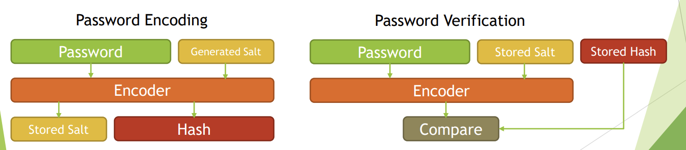
8. As an example, let’s look at how BCrypt will handle process of password encoding and verification:
   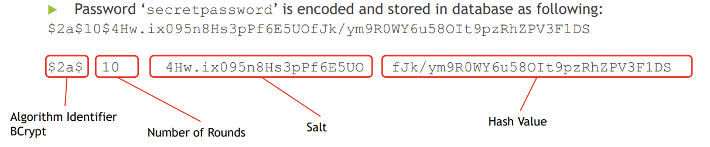
9. Password ‘secretpassword’ is verified
   1. Raw password ‘secretpassword’ is being sent for comparison
   2. Stored password is retrieved as - $2a$10$4Hw.ix095n8Hs3pPf6E5UOfJk/ym9R0WY6u58OIt9pzRhZPV3F1DS
   3. Algorithm identified is checked - $2a$
   4. Number of rounds is retrieved – 10
   5. Salt is retrieved - 4Hw.ix095n8Hs3pPf6E5UO
   6. Hash for provided password is computed
      1. Hash(‘secretpassword’, ‘4Hw.ix095n8Hs3pPf6E5UO’, 10)
   7. Newly generated hash is compared with stored hash
10. Example
    ```java
        @Configuration
        @EnableWebSecurity
        public class WebSecurityConfig extends WebSecurityConfigurerAdapter {
        
            @Autowired
            private DataSource dataSource;
        
            @Override
            protected void configure(HttpSecurity http) throws Exception {
                http
                        .authorizeRequests()
                        .mvcMatchers("/", "/home", "/register").permitAll()
                        .anyRequest().authenticated()
                        .and()
                        .formLogin()
                        .loginPage("/login")
                        .failureUrl("/login-error")
                        .permitAll()
                        .and()
                        .logout()
                        .logoutUrl("/logout")
                        .logoutSuccessUrl("/login")
                        .permitAll();
            }
        
            @Override
            protected void configure(AuthenticationManagerBuilder auth) throws Exception {
                auth
                        .userDetailsService(userDetailsManager())
                        .passwordEncoder(passwordEncoder());
            }
        
            @Bean
            public JdbcUserDetailsManager userDetailsManager() {
                JdbcUserDetailsManager manager = new JdbcUserDetailsManager();
                manager.setDataSource(dataSource);
                return manager;
            }
        
            @Bean
            public PasswordEncoder passwordEncoder() {
                return new BCryptPasswordEncoder();
            }
        }
    ```

Method security
=====
1. Method level security is needed whenever more granular security rules needs to be
   expressed for the application. In some cases having web based rules, written based on URI
   patterns, might not be detailed enough, and additional set of rules needs to be applied to
   the application service layer of application that is being built. In that case method level
   security is helpful.
2. Method level security is typically applied at Application Service Layer.
   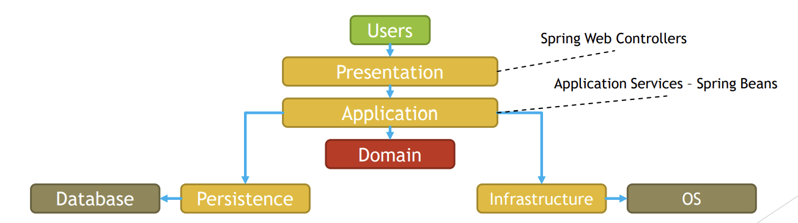
3. Spring supports following method level security annotations:
   1. @Secured
   2. @RolesAllowed (JSR 250)
   3. @PreAuthorize, @PostAuthorize, @PreFilter, @PostFilter
4. Annotations above will work if Method Level Security is enabled by annotation
   @EnableGlobalMethodSecurity, additionally you can choose which type of annotations
   you want to enable:
   1. @Secured
      1. @EnableGlobalMethodSecurity(securedEnabled = true)
   2. @RolesAllowed
      1. @EnableGlobalMethodSecurity(jsr250Enabled = true)
   3. @PreAuthorize, @PostAuthorize, @PreFilter, @PostFilter
      1. @EnableGlobalMethodSecurity(prePostEnabled = true)
   4. you can enable all three at once as well
5. [Source Code](MethodLevelSecurity)

@PreAuthorized and @RolesAllowed
-----------
1. @PreAuthorized and @RolesAllowed annotations are part of Method Security Model
   implemented in Spring Security. Both of those annotations are evaluated before method is
   executed, to check if user is allowed to execute desired method.
2. @RolesAllowed annotation, is very similar to @Secured annotation, and both of those
   allows you to specify list of roles that currently authenticated user needs to have assigned
   to be allowed to execute guarded method. @RolesAllowed annotation is part of JSR 250
   standard. Annotation is enabled by:
   1. @EnableGlobalMethodSecurity(jsr250Enabled = true)
   2. Example
      ```java
              @Controller
        public class CustomersController {
    
            @Autowired
            private CustomersDao customersDao;
    
            @RolesAllowed(SecurityRoles.ROLE_PREFIX + SecurityRoles.CUSTOMERS_READ)
            @GetMapping("/customers")
            public ModelAndView index() {
                return new ModelAndView("customers", "customers", customersDao.findAll());
            }
    
            @RolesAllowed(SecurityRoles.ROLE_PREFIX + SecurityRoles.CUSTOMERS_CREATE)
            @GetMapping("/customers/create")
            public ModelAndView create() {
                return new ModelAndView("customer-create", "customer", new Customer());
            }
    
            @RolesAllowed(SecurityRoles.ROLE_PREFIX + SecurityRoles.CUSTOMERS_CREATE)
            @PostMapping("/customers/create")
            public String create(@ModelAttribute @Valid Customer customer, BindingResult bindingResult) {
                if (bindingResult.hasErrors()) {
                    return "customer-create";
                } else {
                    customersDao.save(customer);
    
                    return "redirect:/customers";
                }
            }
    
            @RolesAllowed(SecurityRoles.ROLE_PREFIX + SecurityRoles.CUSTOMERS_DELETE)
            @GetMapping("/customers/delete/{id}")
            public String delete(@PathVariable Integer id) {
                customersDao.deleteById(id);
    
                return "redirect:/customers";
            }
        }
      ```
3. @PreAuthorized annotation allows you to specify, conditions under which user is
   allowed to execute method, with usage of SpEL expressions. Expression is evaluated before
   method is executed. Annotation support is enabled by:
   1. @EnableGlobalMethodSecurity(prePostEnabled = true)
   2. Example
      ```java
      @Controller
        public class EmployeesController {
        
            @Autowired
            private EmployeesDao employeesDao;
        
            @PreAuthorize("hasRole('ROLE_EMPLOYEES_READ')")
            @GetMapping("/employees")
            public ModelAndView index() {
                return new ModelAndView("employees", "employees", employeesDao.findAll());
            }
        
            @PreAuthorize("hasRole('ROLE_EMPLOYEES_CREATE')")
            @GetMapping("/employees/create")
            public ModelAndView create() {
                return new ModelAndView("employee-create", "employee", new Employee());
            }
        
            @PreAuthorize("hasRole('ROLE_EMPLOYEES_CREATE')")
            @PostMapping("/employees/create")
            public String create(@ModelAttribute @Valid Employee employee, BindingResult bindingResult) {
                if (bindingResult.hasErrors()) {
                    return "employee-create";
                } else {
                    employeesDao.save(employee);
        
                    return "redirect:/employees";
                }
            }
        
            @PreAuthorize("hasRole('ROLE_EMPLOYEES_DELETE')")
            @GetMapping("/employees/delete/{id}")
            public String delete(@PathVariable Integer id) {
                employeesDao.deleteById(id);
        
                return "redirect:/employees";
            }
        }

       ```
4. Difference between those annotation is that @RolesAllowed allows you to specify list of
   required roles, and @PreAuthorized annotation allows you to specify security rule with
   usage of SpEL expression.
5. SpEL expressions that can be used with @PreAuthorized annotation allow for many
   different conditions and logic to be expressed, commonly used functions are:
   1. hasRole
   2. hasAnyRole
   3. hasAuthority
   4. hasAnyAuthority
   5. isAnonymous
   6. isAuthenticated
   7. isRememberMe

How are @PreAuthorized and @RolesAllowed annotations implemented
-----------------
1. @PreAuthorized and @RolesAllowed annotations are implemented with usage
   of Spring AOP and AccessDecisionVoter(s).
2. AccessDecisionVoter(s) are called by AccessDecisionManager, which is
   called by MethodSecurityInterceptor, which are registered by one of
   AdvisorAutoProxyCreator. Pointcuts and Advices for AOP are pointed by
   MethodSecurityMetadataSourceAdvisor. Currently used
   MethodSecurityInterceptor is pointed by
   GlobalMethodSecurityConfiguration#methodSecurityInterceptor.
3. @RolesAllowed annotation is implemented by Jsr250Voter.
4. @PreAuthorized annotation is implemented by
   PreInvocationAuthorizationAdviceVoter.

In which security annotation are you allowed to use SpEL
---------------
1. Spring Security supports SpEL expressions in following annotations:
   1. @PreAuthorize
   2. @PostAuthorize
   3. @PreFilter
   4. @PostFilter
2. Main difference between @PreAuthorize / @PostAuthorize and @PreFilter
   / @PostFilter annotations is that @PreAuthorize / @PostAuthorize are
   used to create expression that will check if method can be executed, @PreFilter
   / @PostFilter on the other hand are used to filter collections based on security
   rules.
3. Example
   ````java
           public interface CustomersDao extends CrudRepository<Customer, Integer> {
            @PreFilter("hasRole('ROLE_CUSTOMERS_CREATE') || (hasRole('ROLE_CUSTOMERS_QA') && filterObject.firstName.equals('TEST'))")
            @Override
            <S extends Customer> Iterable<S> saveAll(Iterable<S> entities);
        
            @PostFilter("hasRole('ROLE_CUSTOMERS_READ') || (hasRole('ROLE_CUSTOMERS_QA') && filterObject.firstName.equals('TEST'))")
            @Override
            Iterable<Customer> findAll();
        
            @PreAuthorize("hasRole('ROLE_CUSTOMERS_DELETE') || (hasRole('ROLE_CUSTOMERS_QA') && entity.firstName.equals('TEST'))")
            @Override
            void delete(Customer entity);
        
            @PostAuthorize("hasRole('ROLE_CUSTOMERS_READ') || (hasRole('ROLE_CUSTOMERS_QA') && returnObject.isPresent() && returnObject.get().firstName.equals('TEST'))")
            @Override
            Optional<Customer> findById(Integer integer);
        }
   ````
